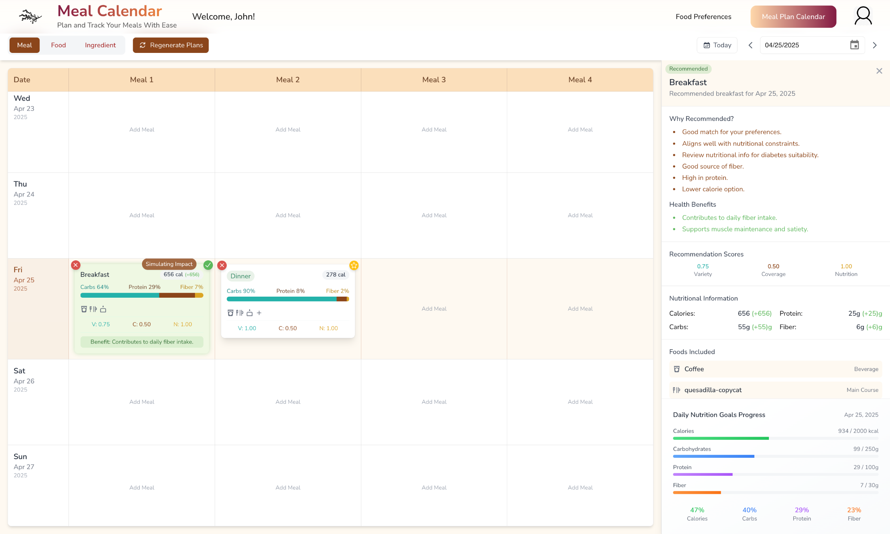
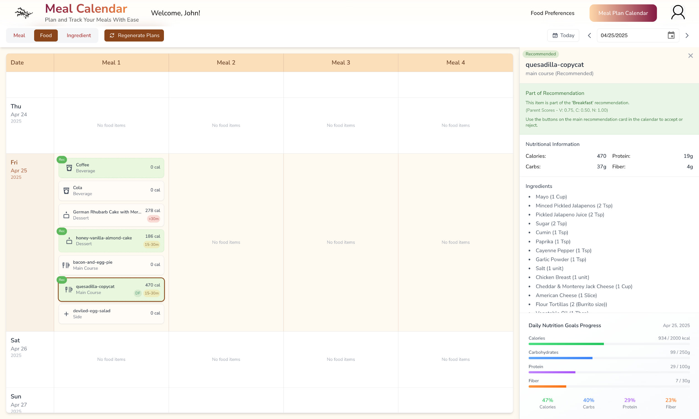
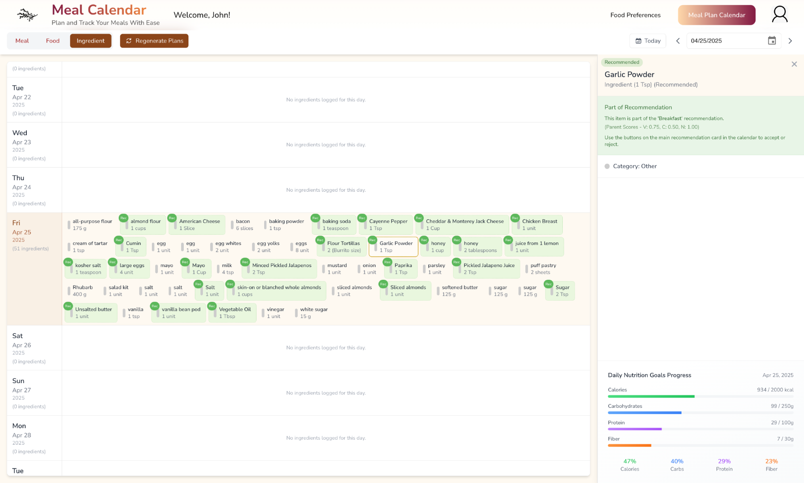

# Beacon of Hope

## Your Personalized, Context-Aware Meal Planning Companion

**Beacon of Hope** is a context-aware meal recommendation engine and dietary planning tool. Whether you're managing a specific dietary condition or just want smarter meal planning, Beacon of Hope provides interactive and personalized meal suggestions with goal tracking.

### Why Beacon of Hope?
- Most meal planners aren't built for people with special dietary needs.
- No unified tool exists that merges nutritional goal tracking **and** context-sensitive meal recommendations.
- We make planning food around your life easier and smarter.

### Who's it For?
Anyone managing a dietary condition:
- Lactose Intolerance
- Veganism
- Nut Allergies

### Key Features
- 🍽️ Receive **context-aware meal recommendations** tailored to your restrictions and goals.
- 📅 Visualize your meals using an **interactive calendar** (meal view, item view, and ingredient view).
- 🎯 Track your **nutritional goal progress** with clarity.

## Preview
We have 3 different views in our calendar feature to view your meals.

1. *Meal-specific view*: This is an overview where you can see your meals planned throughout the day, offering insights into why they were recommended and nutritional information in the meal. Users have the option to accept recommendations, delete meals, and favorite meals.

2. *Food Item-specific view*: This offers a view that delves into each individual component present in the meal (Main Course, Side, Dessert, and Beverage).

3. *Ingredient-specific view*: This offers a list of all of the ingredients required for a particular meal. Giving users an easy way to check what groceries that they need to get in order to prepare those meals.

## Explore the Code
[View our GitHub Repo](https://github.com/SCCapstone/beacon-of-hope)
